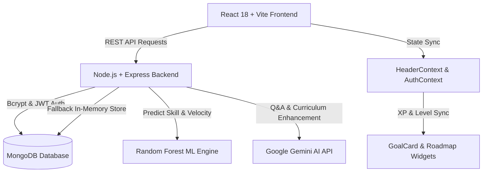

<div align="center">

  # 🤖 PathAI — AI & Random Forest Career Roadmap Generator

  <p align="center">
    <b>Empowering developers with personalized learning paths powered by Ensemble Machine Learning & Generative AI.</b>
  </p>

  [](https://opensource.org/licenses/MIT)
  [](https://react.dev)
  [](https://scikit-learn.org)
  [](https://ai.google.dev)
  [](https://vitejs.dev)
  [](https://tailwindcss.com)

  <br />

  <a href="#-quick-start"><b>Quick Start</b></a> •
  <a href="#-key-features"><b>Key Features</b></a> •
  <a href="#-architecture"><b>Architecture</b></a> •
  <a href="#-ml-engine"><b>ML Engine</b></a> •
  <a href="#-api-reference"><b>API Docs</b></a> •
  <a href="#-license"><b>License</b></a>

</div>

---

## 📌 Table of Contents

- [✨ Overview](#-overview)
- [🌟 Key Features](#-key-features)
- [🏗️ System Architecture](#️-system-architecture)
- [🌲 Machine Learning Engine (Random Forest)](#-machine-learning-engine-random-forest)
- [🚀 Quick Start & Installation](#-quick-start--installation)
- [📡 API Documentation](#-api-documentation)
- [🧪 Verification & Testing](#-verification--testing)
- [📄 License & Authors](#-license--authors)

---

## ✨ Overview

**PathAI** is a full-stack MERN application equipped with a custom-built **Random Forest Machine Learning Engine** and **Google Gemini Generative AI** (`gemini-1.5-flash`). It automatically generates structured, 4-phase learning curricula tailored to a user's target career role (*Backend Developer, Frontend Developer, Fullstack, AI Engineer, Mobile, DevOps, Cybersecurity, or any Custom Role*), skill level (*Beginner, Intermediate, Advanced*), and duration (*4, 8, or 12 weeks*).

> **Highlights:** Real-time XP & Level progression synchronization, interactive Pomodoro study planner, AI doubt solver, skill quizzes, and resilient offline memory fallback modes.

---

## 🌟 Key Features

<details open>
  <summary><b>🎯 1. AI & Machine Learning Roadmap Generator</b></summary>
  <br />
  
  - **Random Forest Classifier & Regressor**: Classifies skill levels, predicts learning velocity, and synthesizes 4-phase customized learning paths.
  - **Adaptive Curriculum Density**: Automatically adjusts phase duration, task types (`theory`, `practice`, `project`, `review`), and estimated minutes per topic.
</details>

<details open>
  <summary><b>⚡ 2. Synchronized XP & Level Progress Engine</b></summary>
  <br />
  
  - **Real-Time Synchronized XP**: Checking a topic awards XP (`+60 XP`, `+92 XP`); unchecking a topic deducts XP immediately.
  - **Level Progress Bar**: Dynamically calculates level milestones (`300 XP` per level) in 100% sync across both the Dashboard and Roadmap pages.
</details>

<details>
  <summary><b>📅 3. Real-Time Study Planner & Focus Timer</b></summary>
  <br />
  
  - **Dynamic Calendar**: Calculates current week dates (Monday–Sunday) in real-time, highlighting `TODAY`.
  - **Pomodoro Focus Timer**: Interactive countdown timer (`45:00`) with Start/Pause/Reset controls that awards XP and increments study streaks.
</details>

<details>
  <summary><b>🔐 4. Resilient JWT Authentication & Fail-Safe DB Mode</b></summary>
  <br />
  
  - **Bcrypt Password Hashing**: Secure user credential authentication and JWT token management.
  - **Fail-Safe Server Resilience**: Express server operates seamlessly in Memory-Resilient Mode if local MongoDB is offline.
</details>

---

## 🏗️ System Architecture



---

## 🌲 Machine Learning Engine (Random Forest)

PathAI uses a single, integrated **Random Forest Ensemble** (`backend/ml/mlEngine.js`) built with multiple decision trees:

```
                  ┌────────────────────────────────────────┐
                  │      User Input Specifications         │
                  │  (Role, Skill Level, Target Weeks)     │
                  └───────────────────┬────────────────────┘
                                      │
               ┌──────────────────────┴──────────────────────┐
               │                                             │
      ┌────────▼────────┐                           ┌────────▼────────┐
      │ Decision Tree 1 │                           │ Decision Tree 2 │
      │ (Difficulty Tiers)                          │ (Pacing Multipliers)
      └────────┬────────┘                           └────────┬────────┘
               │                                             │
               └──────────────────────┬──────────────────────┘
                                      │
                         ┌────────────▼────────────┐
                         │   Ensemble Voting /     │
                         │   Curriculum Synthesizer│
                         └────────────┬────────────┘
                                      │
                         ┌────────────▼────────────┐
                         │ 4-Phase Customized Path │
                         └─────────────────────────┘
```

---

## 🚀 Quick Start & Installation

### 📋 Prerequisites
- **Node.js**: v18.0.0 or higher
- **npm**: v9.0.0 or higher
- **MongoDB**: Optional (Server features automatic offline memory fallback)

---

### 💻 Step-by-Step Installation

<details open>
  <summary><b>1. Clone Repository & Setup Environment</b></summary>
  <br />

  ```bash
  # Clone the repository
  git clone https://github.com/sankulprana/Ai_peronalized-path_generator.git
  cd Ai_peronalized-path_generator
  ```
</details>

<details open>
  <summary><b>2. Backend Setup</b></summary>
  <br />

  ```bash
  # Navigate to backend directory
  cd backend

  # Install Node dependencies
  npm install

  # Create environment configuration (.env)
  echo "PORT=5000" > .env
  echo "MONGO_URI=mongodb://127.0.0.1:27017/pathai" >> .env
  echo "JWT_SECRET=pathai_secret_key_2026" >> .env

  # Start Backend API in Development Mode
  npm run dev
  ```
  > 🌐 Backend API running at: `http://localhost:5000/api`
</details>

<details open>
  <summary><b>3. Frontend Setup</b></summary>
  <br />

  ```bash
  # Return to root directory
  cd ..

  # Install frontend dependencies
  npm install

  # Start Vite Development Server
  npm run dev
  ```
  > 🌐 Frontend Application running at: `http://localhost:5173`
</details>

---

## 📡 API Documentation

<details>
  <summary><b>🔑 Authentication Endpoints</b></summary>
  <br />

  | Method | Endpoint | Description | Auth Required |
  | :--- | :--- | :--- | :---: |
  | `POST` | `/api/auth/register` | Register a new user account | No |
  | `POST` | `/api/auth/login` | Authenticate user & return JWT token | No |
  | `GET` | `/api/auth/profile` | Retrieve active user profile | Yes (JWT) |
</details>

<details>
  <summary><b>🗺️ Roadmap & ML Endpoints</b></summary>
  <br />

  | Method | Endpoint | Description | Auth Required |
  | :--- | :--- | :--- | :---: |
  | `POST` | `/api/roadmaps/generate` | Generate AI/ML personalized roadmap | Optional |
  | `GET` | `/api/roadmaps` | Fetch user active roadmaps | Optional |
  | `PATCH` | `/api/roadmaps/:id/tasks/:taskId` | Toggle task completion status | Optional |
  | `POST` | `/api/ml/predict` | Run Random Forest prediction model | No |
</details>

<details>
  <summary><b>💡 Study Planner & Doubt Solver</b></summary>
  <br />

  | Method | Endpoint | Description | Auth Required |
  | :--- | :--- | :--- | :---: |
  | `GET` | `/api/planner` | Fetch dynamic study schedule | Optional |
  | `POST` | `/api/ai/doubt-solver` | Ask technical questions to Gemini AI | No |
  | `GET` | `/api/quizzes` | Fetch domain skill quizzes | No |
</details>

---

## 🧪 Verification & Testing

```bash
# Run production build check
npm run build
```

---

## 📄 License & Authors

Distributed under the **MIT License**. See `LICENSE` for more information.

<div align="center">
  <sub>Built with ❤️ by the PathAI Engineering Team</sub>
</div>
